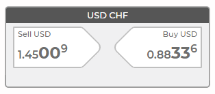
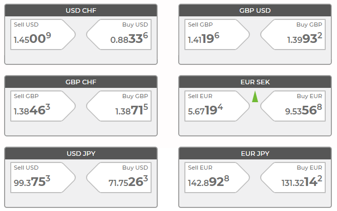
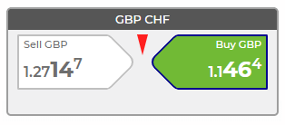
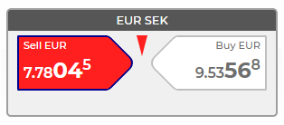
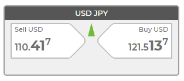
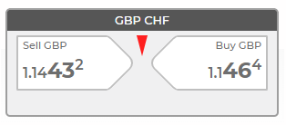

# FX Trading App
Build the following application using HTML, JavaScript & CSS.<br>
You may use any other non-commercial libraries you wish.<br>
Note, using the exact colours and dimensions are not important,<br> 
but please try to make your app look similar to the images below.<br>

### Link:
[https://szymtur.github.io/fx-trading-app](https://szymtur.github.io/fx-trading-app)

### Tasks:
1. Build this panel as a component:<br><br>


2. Now layout multiple panels as follows:<br><br>


3. The datasource is:
    ```json
    [
      {"pair":"USD CHF", "buy":0.99143, "sell":0.99043},
      {"pair":"GBP USD", "buy":1.28495, "sell":1.2836},
      {"pair":"GBP CHF", "buy":1.27378, "sell":1.27147},
      {"pair":"EUR SEK", "buy":9.6320, "sell":9.6055},
      {"pair":"USD JPY", "buy":110.467, "sell":110.417},
      {"pair":"EUR JPY", "buy":120.589, "sell":120.491}
    ]
    ```

4. On hovering the mouse over the left price indicator,<br> 
change the colour to red with a blue border.<br> 
On hovering the mouse over the right price indicator,<br> 
change the colour to green with a blue border.<br><br>
 

5. To test your app, you should write a test harness that changes the prices<br> 
randomly every 1 second to within +/- 10% of the original value.<br> 
If the buy price increases, show a green upwards facing arrow between the two price indicators.<br> 
If the buy price decreases, show a red downwards facing arrow.<br><br>
 
